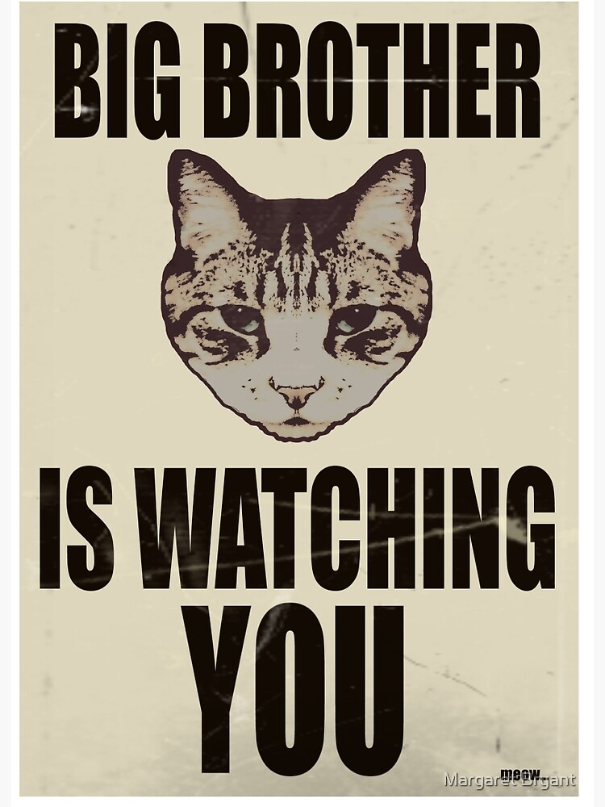

# Challenge - Steganography

Olá camarada!

Estamos em 2084 e vivemos sob regime ditatorial de gatinhos, somos obrigados em nosso cotidiano a acariciar gatinhos, abanar penas ou cordinhas e cooperamos na produção de sachês. A confraria, uma organização secreta revolucionária conseguiu enviar uma mensagem ao passado pedindo para que alguém criasse um classificador que identifica gatinhos e cachorros (nossos principais aliados). Agora que conseguimos distinguir entre cachorros e gatinhos precisamos criar um meio de transmitir as informações das rotinas dos gatos malvados (em quantas casas eles vivem, quantos humanos são adestrados e por quais telhados e ruas passeiam). Soubemos que você é a pessoa certa para isso e o sucesso da revolução depende de você!

Pensando em um meio de enviar mensagens escondidas em imagens para outros proletarios, precisamos de uma API que possua algumas rotas:

- `/upload`: Uma requisição `POST` que recebe um `multipart/form-data` com uma imagem **bitmap** e retorna o nome do arquivo armazenado em um diretório temporário do servidor
- `/write-message-on-image`: Uma requisição `POST` que recebe um `application/json` com o caminho da imagem (resposta do `/upload`), aplica um algoritmo de Esteganografia (será descrito melhor abaixo) retornando um JSON informando o nome do novo arquivo
- `/get-image`: Uma requisição `GET` que recebe na query o nome da imagem a ser acessada e retorna o arquivo para download
- `/decode-message-from-image`: Uma requisição `GET` que recebe na query o nome da imagem a ser decodificada e retorna a mensagem escondida na imagem

O algoritmo de [Esteganografia deve ser do tipo LSB (Least Significant Bit)](https://zenodo.org/record/262996/files/Chapter%2017.pdf?download=1), funciona mais ou menos assim:

Gostariamos de escrever a letra `A` usando o algoritmo de esteganografia LSB. A letra pode ser representada em ASCII binário como `01000001`.
Devemos separar cada um dos bits: `[0 1 0 0 0 0 0 1]`.
Pegar os 8 primeiros bytes da imagem original:

| byte 0 | byte 1 | byte 2 | byte 3 | byte 4 | byte 5 | byte 6 | byte 7 |
| :-- | :-- | :-- | :-- | :-- | :-- | :-- | :-- |
| `10010000` | `10011010` | `10011100` | `10010010` | `10010110` | `10011101` | `10101111` | `10100101` |

E Devemos substituir os ultimos bits de cada um dos bytes por 1 bit da mensagem. Ficando assim:

| byte 0 | byte 1 | byte 2 | byte 3 | byte 4 | byte 5 | byte 6 | byte 7 |
| :-- | :-- | :-- | :-- | :-- | :-- | :-- | :-- |
| `10010000` | `10011011` | `10011100` | `10010010` | `10010110` | `10011100` | `10101110` | `10100101` |

Alguns pré-requisitos/definições/combinados:

- Você define qual linguagem de programação usar.
- Você deve implementar utilizando apenas bibliotecas padrão da linguagem de programação escolhida.
- Uma mensagem comporta sempre uma frase, terminando sempre com o caractere `.` (ou em binário `00101110`). Assim você não precisa vasculhar a imagem inteira.
- Documente seu código, crie testes e por favor crie um documento com comandos para executar as requisições usando `curl`.

Caso precise de ajuda, sinta-se a vontade para entrar em [contato](mailto:time@cromai.com) perguntando ou pedindo explicações!

Ao terminar a API crie um arquivo ZIP desse repositório e nos envie com um GIF de gatinhos fazendo maldade para o e-mail: [time@cromai.com](mailto:time@cromai.com).

Utilize firefox ou algum visualizador de markdown para visualizar as imagens abaixo ([grip](https://pypi.org/project/grip/))
| Original image | Output image |
| :-- | :-- |
|  |  |

Algumas referências que podem te ajudar:

- [BMP File Format](https://www.digicamsoft.com/bmp/bmp.html)
- [Bits to Bitmaps: A simple walkthrough of BMP Image Format - Uday Hiwarale](https://medium.com/sysf/bits-to-bitmaps-a-simple-walkthrough-of-bmp-image-format-765dc6857393)
- [Data Hiding Using Least Significant Bit Steganography in Digital Images - B.Chitradevi, N.Thinaharan and M.Vasanthi](https://zenodo.org/record/262996/files/Chapter%2017.pdf?download=1)
- [Tabela ASCII](https://www.ime.usp.br/~kellyrb/mac2166_2015/tabela_ascii.html)
